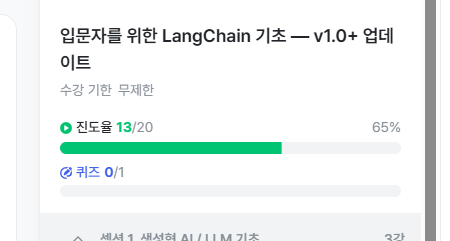

# TIL

## 2026-09-21

### 
생성형 ai란? 
1. 정의
학습된 분포에서 다음 토큰을 확률적으로 샘필링하는 모델 -> 예측개념
2. 핵심 단위
토큰 - 평균 한국어 1글자 = 2~3토큰
3. Context Window
한 요청에 담을 수 있는 토큰 총량(입출력)
4. 확률에 따라 랜덤으로 선택됨 -> 출력을 보장할 수 없음
5. temperature ---> 완벽하게 결정론적이 않음 : 확률 분포의 모양을 바꿈, 올라갈수록 분포가 완만해짐
6. Top K: 갯수 기반
7. Top P: 누적 상위 확률 기반
8. max_token:출력 길이 상한 - 비용 직결, 작업 별로 빡빡하게 설정을 권장
9. stop: 특정 문자열 만나면 중단, 구조화 출력에서 유용.

####
Lang-chain 이란? 
1. Messages
(1) systemmessage: 페르소나/제약설정
(2) humanmessage: 사용자 입력
(3) aimessage: 모델 응답
(4) toolmessage: 도구 실행 결과

2. LCEL - 파이프 연산자로 체인 구성
    단계          입력         출력
(1) prompt      변    채워진 프롬포트
(2) llm         프롬포트   aimessage
(3) stroutputparser aimessage  str

3. Runnavble 컴포넌트
(1) RunnablePassthrouh: 입력을 그대로 전달 (분기 합류용)
(2) RunnableLamda: 임의 함수를 runnable로 래핑
(3) RunnableParllel: 여러 체인 병렬 실행 -> dict 합치기
(4) RunnableBranch: 조건 분기 처리
(5) .with_config(...): run_name, tags, callbacks 주입

##### 
1. 프롬포트 템플릿: 동일한 프롬포트 패턴을 여러 입력에 재사용할 때 사용
2. output parser: 가장 단순한 형태의 파서. str부분만 추출

######
1. zero-shot의 한계
예시 없이 모델에게 요청하면 출력형식이 불안정해진다 - 예시를 하나라도 보여주면 출력 형식이 즉시 안정화된다
2. Few-shot - 패턴 학습, 일관된 출력 보장
3. Example Selctror: 입력과 가장 유사한 예시만 입력

#####
1. LLM 
(1) 추론은 가능하지만 실시간 정보 접근 불가, 외부 시스템 호출 불가. 
(2) 정적인 지식만 활용 가능
2. Tool데코레이터: 가장 단순한 도구 정의
3. LCL 체인 - 정해진 순서로 고정 실행
(1) 정해진 순서 실행
(2) 분기 = 명시적 runnableBranch
(3) 디버깅 쉬움
(4) 단순 작업에 적합
4. 에이전트 - LLM판단으로 동 선택/반복
(1) LLM이 도구 선택/반복
(2) 분기 = LLM의 판단
(3) 비결정적 - 추적 필수 
(4) 복합/자율 작업에 적합
--공통점 : 도구 사용/입력/출력 공유
5. 미들웨어?
6. 복합 질문 - 멀티 도구 자율 조합
LLM이 자율적으로 여러 도구를 순서대로 호출하고 결과를 호출
7. 스트리밍 - 사고 과정 관찰
8. 메모리 - 메모리세이버
9. 구조화 출력 - 전략 비교
(1) 툴전략 - 모든 모델, 도구 호출 방식, 유연한 커스터 마이징
(2) 프로바이더전략 - 지원 모델, 네이티브 구조화 출력?, 더 간결한 구현
10. 동적 프롬포트 미들웨어  - 요청 수신시 동적 프롬포트 주입, 맞춤화 컨텍스트 제공

######
1. 왜 RAG인가? 
(1) 최신 정보 
1) LLM: 학습 데이터 시점 이후 정보 없음
2) RAG: 최신 문서를 검색해 컨택스트 주입
(2) 비공개 데이터 
1) LLM: 사내/비공개 데이터 모름 
2) RAG: 사설 문서를 인덱싱하여 활요
(3) 할루시네이션
1) LLM: 근거 없는 답변 생성
2) RAG: 근거문서 + 모르면 모른다고 프롬포트
(4) 비용
1) LLM: 긴 텍스트 처리 비용 과다
2) RAG: 관련 청크만 추려 비용 절감
2. 문서 로더
(1) 텍스트
(2) PDF
(3) 웹
(4) 디렉토리
3. Text Splitter
(1) 캐릭터 텍스트 - 단순 구분자 기반. 문맥 보존에 약함
(2) 리크루시브캐릭터 - 자연스러운 분할
(3) 헤더단위 - 구조화된 문서 
(4) 토큰 텍스트 - 토큰 한도 설정 가능
4. 임베팅 - 단어와 문장을 벡터 공간의 조표로 변환하여 의미적 유사도를 계산할 수 있게 함
5. 벡터 스토어?
6. LCEL로 RAG체인 조립? -> 파이프라인으로 연결 

### 실습 이미지

